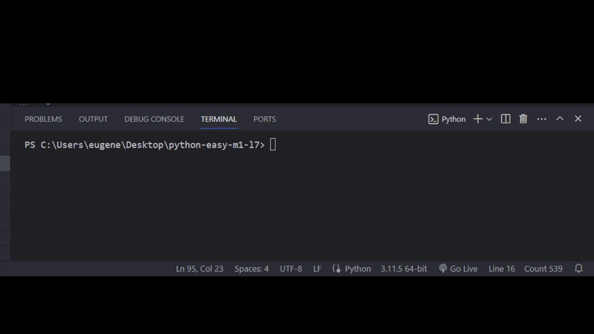

# Задача 3

**Дополни код программы**

Бо сидя на лекциях вспомнил про старую игру agar.io. Он решил в нее поиграть.

Когда Бо набрал 13000 очков, он заметил что на сайте где он играл, нет рейтинга топ игроков. Он решил написать свою программу, которая найдет победителя по количеству очков.

Помоги Бо закончить его программу, программа должна проверить все возможные сценарии победы, иначе — ничья.

# Решение

