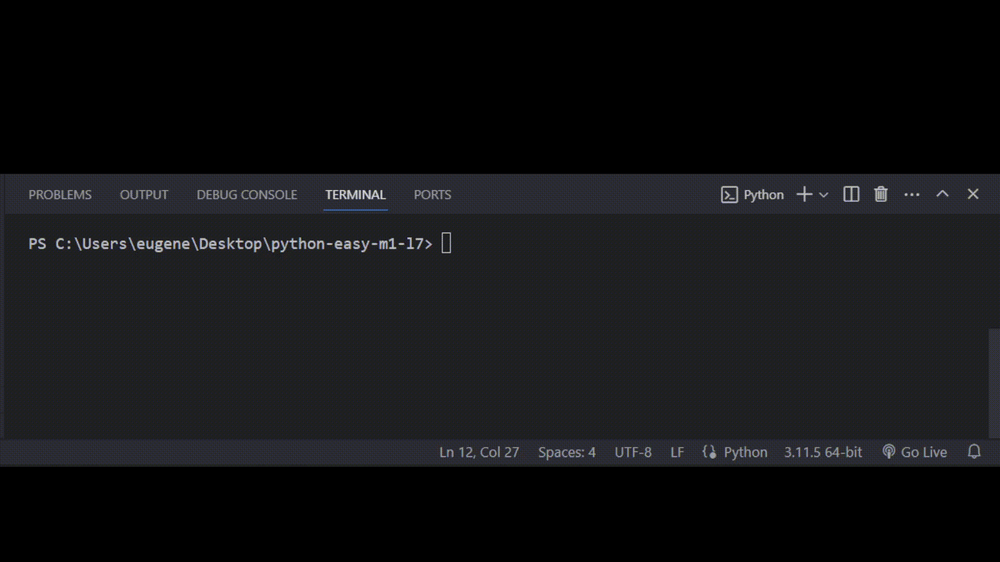

# Задача 1

**Исправь ошибки в коде**

После кражи данных академии, многие заметили уязвимость в защите файлов с важными данными. Уязвимость заключалась в отсутствии проверки, какие файлы попадают в систему, из-за чего в нее смог проникнуть вирус.

Бо дали задание написать программу которая найдет и удалит файлы с вирусом. Он допустил пару ошибок в коде, помоги Бо их исправить.

# Решение

